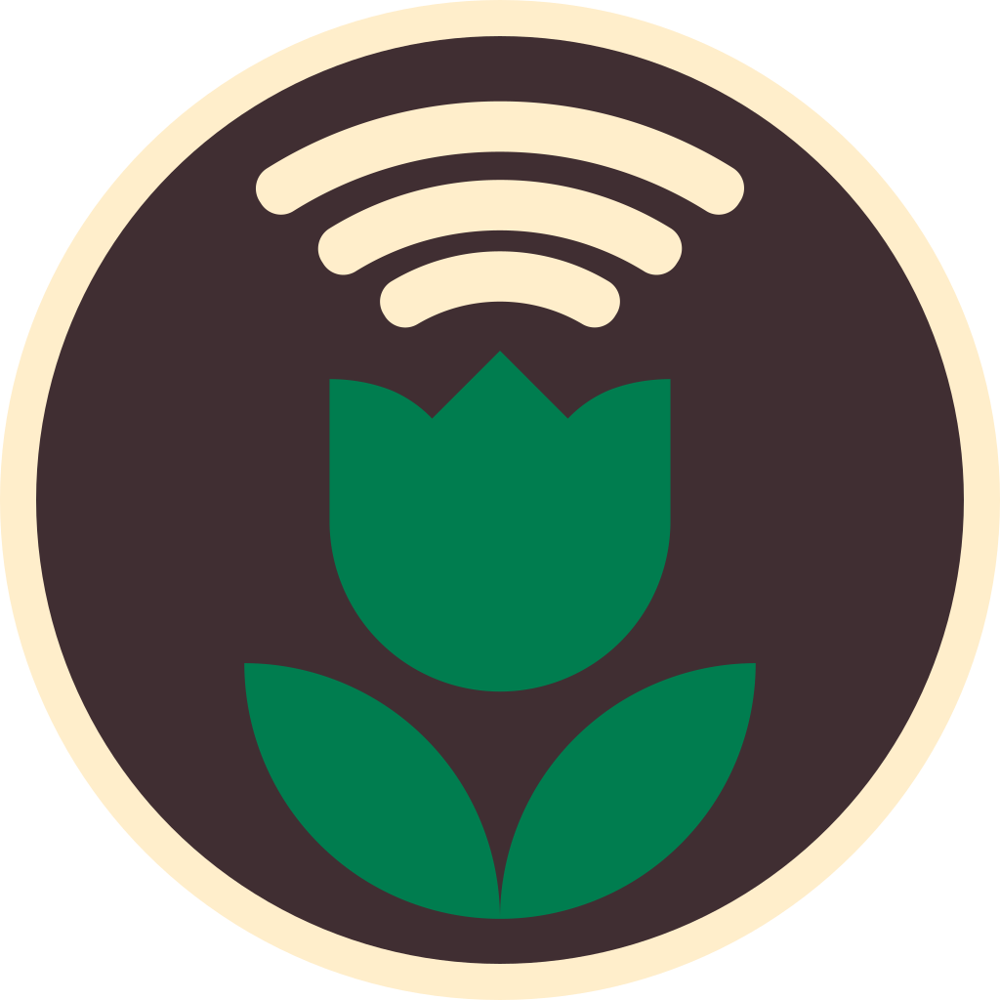
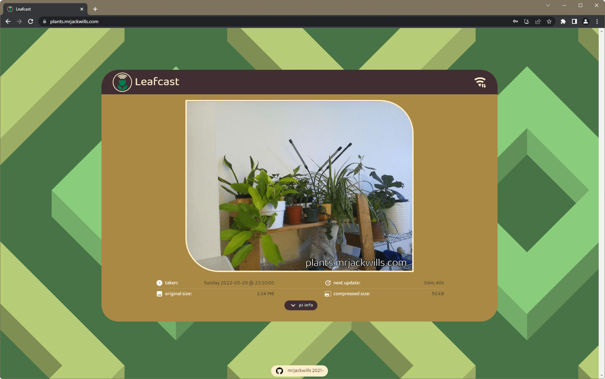

<p align="center">
	
</p>

<h1 align="center">Leafcast website</h1>

<p align="center">
	The frontend for <a href='https://plants.mrjackwills.com' target='_blank' rel='noopener noreferrer'>Leafcast</a>, powered by <a href='https://www.staticpi.com' target='_blank' rel='noopener noreferrer'>staticPi.com</a>
</p>
<p align="center">
	Built using <a href='https://vuejs.org/' target='_blank' rel='noopener noreferrer'>vue.js</a>, and <a href='https://www.typescriptlang.org/' target='_blank' rel='noopener noreferrer'>Typescript</a>
</p>

<p align="center">
	Front end to the <a href='https://github.com/mrjackwills/leafcast_pi' target='_blank' rel='noopener noreferrer'>pi backend client</a>
	<br>
	<a href='https://plants.mrjackwills.com' target='_blank' rel='noopener noreferrer'>See the plants</a>, password available on request
</p>

<p align="center">
	<a href="https://raw.githubusercontent.com/mrjackwills/leafcast_vue/main/.github/screenshot.png" target='_blank' rel='noopener noreferrer'>
		
	</a>
</p>


## Required services

1) <a href='https://www.staticpi.com/' target='_blank' rel='noopener noreferrer'>staticPi</a> - the simple and secure messaging service


File that are required by Leafcast
| file | reason|
|---|---|
|```./.env.development```	| development enviromental variables|
|```./.env.development```	| productions enviromental variables|

### Development
---

```npm run serve```

### Build step
---
```node build``` or ```npm run build```